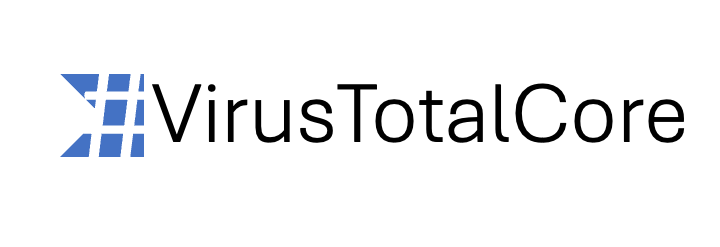

[](https://github.com/hunterlan/VirusTotalCore/actions/workflows/dotnet.yml)


# VirusTotalCore
VirusTotalCore is an unofficial .NET library that gives a possibility to work with VirusTotal by implemented API. With this library, 
developers can request scans for URLs, files, get report about domains and IPs, retrieve comments and votes from 
community and add owns.

Currently, next endpoints is implemented in library:
- IP addresses
- Comments
- Domains
- Files
- URLs

# Usage example

You have to create one of fifth presented endpoints. 
You have to pass to constructor API key, which can be found on user profile page.
After creating a endpoint, you can call functions, that mostly are same as in VirusTotal documentation.
```
var apiKey = "<Your api key>";
var commentEndpoint = new CommentEndpoint(apiKey);

var latestComments = commentEndpoint.GetLatest(null, null, new CancellationToken());
```

# Installation

Currently, it's only possible to make library from source code. NuGet package will be added as soon as possible.

# Minimal requirements

Library requires to use at least .NET 8.

**External dependencies**

- [RestSharp](https://github.com/restsharp/RestSharp)
- [XUnit](https://github.com/xunit/xunit)

# Contributing
See [CONTRIBUTING](CONTRIBUTING.md)

# License
See [LICENSE](LICENSE)

# Note

Ensure to stick with the terms of use and guidelines provided by VirusTotal when using this library in your applications.